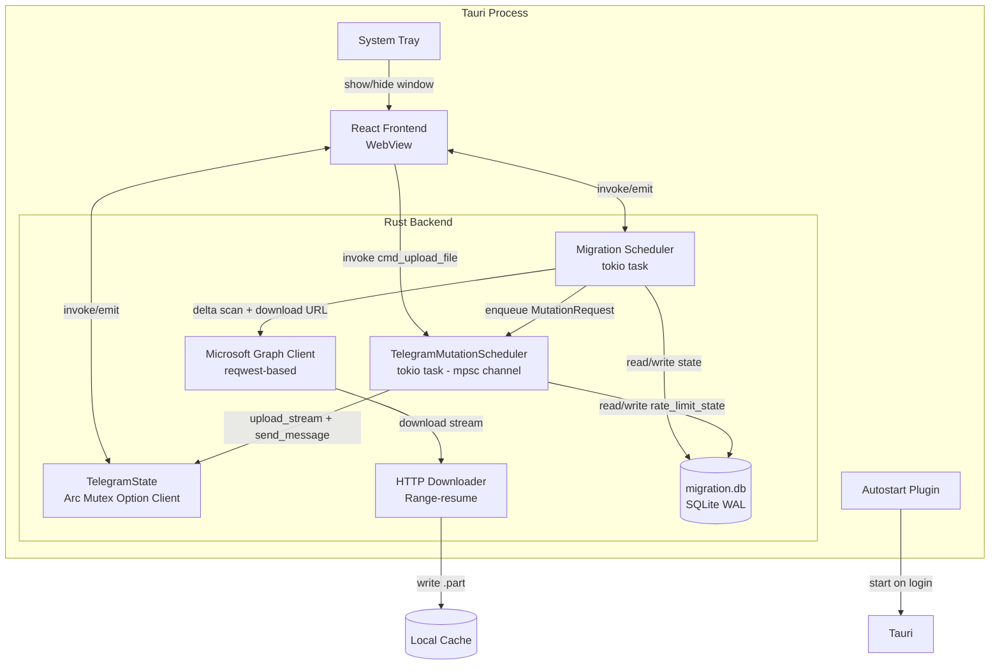

# Kế hoạch Triển khai: OneDrive Continuous Migration

**Branch**: `001-onedrive-continuous-migration` | **Ngày**: 2026-07-23 | **Spec**: [spec.md](./spec.md)

**Đầu vào**: Đặc tả tính năng từ `/specs/001-onedrive-continuous-migration/spec.md`

## Ngôn ngữ

**QUAN TRỌNG**: Toàn bộ nội dung plan này được viết bằng **Tiếng Việt**. Chỉ giữ tên công nghệ, thư viện, biến/hàm/lớp bằng Tiếng Anh.

## Tóm tắt

OneDrive Continuous Migration cho phép người dùng tự động đồng bộ file từ thư mục OneDrive sang Telegram một cách liên tục. Hệ thống chạy như các tokio tasks trong Tauri process hiện tại (In-Process Worker), dùng SQLite WAL (`migration.db`) để lưu toàn bộ trạng thái, chia sẻ chung `TelegramState` với UI qua cơ chế Tauri state. Một `TelegramMutationScheduler` duy nhất (channel-based queue) xử lý mọi upload — cả thủ công lẫn migration — với cơ chế chống flood thích nghi. Microsoft Graph được gọi trực tiếp qua `reqwest`, không dùng SDK. Frontend React 19 + Tailwind CSS 4 cung cấp wizard thiết lập 5 bước và dashboard giám sát real-time.

## Bối cảnh Kỹ thuật

**Ngôn ngữ/Phiên bản**: Rust (Tauri v2, edition 2021) + TypeScript (React 19)

**Phụ thuộc chính**:
- Backend: `tauri` v2, `tokio`, `grammers` (MTProto client), `sqlite` 0.37.0, `reqwest` 0.12, `sha2`, `aes-gcm`/`ring`, `hostname`
- Frontend: `react` 19, `tailwindcss` 4, `framer-motion`, `lucide-react`, `@tanstack/react-query`, `sonner`

**Lưu trữ**: SQLite (`migration.db`) tại `{app_data}/migration/migration.db` với WAL mode, synchronous=FULL, foreign_keys=ON. Token Microsoft được mã hóa AES-256 lưu trên đĩa.

**Kiểm thử**: `cargo test` cho Rust unit/integration tests; mock HTTP server cho Graph API; manual E2E cho luồng đầy đủ.

**Nền tảng mục tiêu**: Desktop (macOS, Windows, Linux). Không hỗ trợ mobile MVP.

**Loại dự án**: Desktop app (Tauri v2) — single binary, không sidecar.

**Mục tiêu hiệu năng**:
- Tối thiểu 10 file/giờ cho file nhỏ (< 10MB), 2 file/giờ cho file lớn (> 100MB)
- Không bị Telegram FLOOD_WAIT quá 1 lần mỗi 24 giờ
- Phục hồi sau crash trong vòng 30 giây từ lúc khởi động lại

**Ràng buộc**:
- Đồng thời upload = 1 (ép buộc ở backend)
- Pacing giữa các upload: ≤1 MiB: 45-90s; 1-10 MiB: 30-60s; >10 MiB: 15-30s
- FLOOD_WAIT cooldown phải tồn tại qua restart
- Token Microsoft phải được mã hóa trước khi lưu đĩa

**Phạm vi/Quy mô**: 9 files Rust mới trong `migration/` module (~2500-3500 dòng), 1 migration DB (5 bảng + schema_version table), 3-4 components React mới, sửa ~5 files hiện có.

## Kiểm tra Constitution

*GATE: Phải vượt qua trước Phase 0 research. Kiểm tra lại sau Phase 1 design.*

| Nguyên tắc | Trạng thái | Ghi chú |
|---|---|---|
| **I. Tiếng Việt là ngôn ngữ chính thức** | ✅ ĐẠT | Toàn bộ tài liệu, comment code, commit message viết bằng Tiếng Việt. Tên biến/hàm/lớp giữ tiếng Anh. |
| **II. Actix Web (HTTP) + Tokio (Background)** | ✅ ĐẠT | Constitution v1.1.0 cho phép Tokio tasks cho background orchestration. Migration dùng Tokio tasks trong Tauri runtime. Actix vẫn dùng cho HTTP server/API routes. |
| **III. Tauri IPC + React Frontend** | ✅ ĐẠT | Frontend giao tiếp qua `invoke()`/`emit()` Tauri hiện có. React Context cho state management. |
| **IV. Telegram MTProto làm storage layer** | ✅ ĐẠT | Upload qua `TelegramState` client hiện có, dùng `upload_stream()` + `send_message()`. |
| **V. SQLite Database** | ✅ ĐẠT | `migration.db` riêng với raw SQL queries, migration thủ công, cùng crate `sqlite` 0.37.0. |
| **VI. Spec-Driven Development** | ✅ ĐẠT | Spec → Plan → Tasks → Implement → Converge. Spec đã được tạo và duyệt. |
| **VII. Background Processing** | ✅ ĐẠT | System tray + close-to-tray + autostart + single-instance + automatic recovery. Worker in-process, không sidecar. |
| **Quality Gate: Xử lý lỗi đúng pattern** | ✅ ĐẠT | Dùng `Result<T, String>` cho tất cả migration functions. Frontend có ErrorBoundary. |
| **Quality Gate: i18n cho UI text** | ✅ ĐẠT | i18n có ngay từ UI phase đầu tiên (PR 8). Mọi UI string mới qua cơ chế i18n hiện có. |

**Kết luận**: Tất cả gates đều ĐẠT. Không có vi phạm constitution.

## Cấu trúc Dự án

### Tài liệu (tính năng này)

```text
specs/001-onedrive-continuous-migration/
├── spec.md               # Đặc tả tính năng (đã có)
├── plan.md               # File này (output của /speckit.plan)
├── research.md           # Phase 0 output
├── data-model.md         # Phase 1 output
├── quickstart.md         # Phase 1 output
├── contracts/            # Phase 1 output — Tauri command contracts
│   ├── migration-commands.md
│   └── migration-events.md
└── tasks.md              # Phase 2 output (/speckit.tasks — KHÔNG tạo bởi /speckit.plan)
```

### Mã nguồn (thư mục gốc repository)

```text
app/
├── src/                          # Frontend React/TypeScript
│   ├── App.tsx                   # [SỬA] Thêm route migration dashboard
│   ├── types.ts                  # [SỬA] Thêm kiểu MigrationJob, MigrationItem, v.v.
│   ├── components/
│   │   ├── desktop/
│   │   │   └── DesktopDashboard.tsx  # [SỬA] Thêm mục sidebar "OneDrive Migration"
│   │   └── shared/
│   │       ├── MigrationWizard.tsx       # [MỚI] Wizard thiết lập 5 bước
│   │       ├── MigrationDashboard.tsx    # [MỚI] Dashboard trạng thái real-time
│   │       ├── MigrationSettings.tsx     # [MỚI] Cấu hình migration
│   │       └── MigrationStatusCard.tsx   # [MỚI] Card trạng thái nhỏ gọn
│   ├── hooks/
│   │   └── useMigration.ts        # [MỚI] Hook giao tiếp backend
│   ├── i18n/
│   │   └── locales/
│   │       ├── vi/migration.json   # [MỚI] Bản dịch tiếng Việt
│   │       └── en/migration.json   # [MỚI] Bản dịch tiếng Anh
│   └── context/
│       └── SettingsContext.tsx     # [SỬA] Thêm migration settings
│
├── src-tauri/
│   ├── Cargo.toml                 # [SỬA] Thêm deps: sha2, aes-gcm, hostname, tauri-plugin-autostart
│   ├── tauri.conf.json            # [SỬA] Thêm plugin autostart, cấu hình tray
│   ├── capabilities/
│   │   └── default.json           # [SỬA] Thêm permission migration
│   └── src/
│       ├── lib.rs                 # [SỬA] Khởi tạo DB, scheduler, tray, autostart
│       ├── commands/
│       │   └── fs.rs              # [SỬA] Route upload qua scheduler, trả message_id
│       └── migration/             # [MỚI] Module migration
│           ├── mod.rs             # Public API, điểm vào scheduler
│           ├── db.rs              # Khởi tạo DB, schema migrations, CRUD queries
│           ├── state_machine.rs   # JobState & ItemState enums + transition validation
│           ├── graph.rs           # Microsoft Graph client (auth, delta, download URL)
│           ├── downloader.rs      # HTTP download với Range resume
│           ├── upload_adapter.rs  # Hàm upload tái sử dụng (trích từ cmd_upload_file)
│           ├── flood_guard.rs     # TelegramMutationScheduler + pacing + flood guard
│           ├── scheduler.rs       # Vòng lặp migration chính
│           └── reconciler.rs      # Phục hồi trạng thái khi khởi động
│
└── docs/
    └── onedrive-migration/        # Tài liệu tham khảo chi tiết (đã có)
        ├── OPTIMIZED_SPEC.md
        ├── IMPLEMENTATION_PLAN.md
        ├── ARCHITECTURE_DECISION.md
        ├── DATABASE_DESIGN.md
        ├── STATE_MACHINE.md
        ├── FAILURE_RECOVERY.md
        ├── TELEGRAM_FLOOD_GUARD.md
        ├── MICROSOFT_GRAPH_DESIGN.md
        ├── UI_UX_SPEC.md
        ├── CODEBASE_MAP.md
        ├── ASSUMPTION_AUDIT.md
        └── TEST_PLAN.md
```

## Phase 0: Nghiên cứu & Phân tích

### Các quyết định đã được xác nhận

Tất cả các điểm "NEEDS CLARIFICATION" trong bối cảnh kỹ thuật đã được giải quyết thông qua phân tích codebase thực tế và tài liệu tham khảo. Dưới đây là bảng tổng hợp:

| Vấn đề | Quyết định | Lý do | Phương án thay thế |
|---|---|---|---|
| **Kiến trúc Worker** | In-Process Tokio Worker | Chia sẻ session dễ dàng, thay đổi code tối thiểu, đóng gói đơn giản | Sidecar (phức tạp IPC, không chia sẻ được session), OS Service (quá phức tạp cho MVP) |
| **Database** | `migration.db` riêng | Phân tách mối quan tâm, vòng đời độc lập, sẵn sàng cho sidecar sau này | Dùng chung `shares.db` (làm phức tạp schema hiện tại) |
| **Hàng đợi Upload** | `TelegramMutationScheduler` với channel `tokio::mpsc` | Một điểm kiểm soát duy nhất, chống flood đồng nhất, ưu tiên upload thủ công | Queue riêng cho migration (dễ gây flood chéo) |
| **Microsoft Graph** | REST trực tiếp qua `reqwest` | `reqwest` đã có sẵn, SDK Rust chưa trưởng thành, đơn giản hơn | `graph-rs-sdk` (nặng, ít trưởng thành) |
| **Xác thực Microsoft** | OAuth 2.0 PKCE + Device Code fallback | Loopback redirect hoạt động trên mọi desktop OS, device code cho headless | Client secret (không an toàn cho desktop app) |
| **Mã hóa Token** | AES-256, khóa từ hostname + machine UUID | Bảo vệ token khi lưu đĩa, không cần người dùng nhập passphrase | Lưu plaintext (không an toàn), OS keychain (phức tạp cross-platform) |
| **Tray & Autostart** | Tauri tray API + `tauri-plugin-autostart` | Tauri cung cấp sẵn, cross-platform, đơn giản | Custom tray implementation (không cần) |
| **Single-Instance** | Tauri single-instance plugin hoặc file lock | Ngăn nhiều Tauri process chạy migration worker song song | Không có guard (risk duplicate worker) |
| **BandwidthManager** | Reuse `BandwidthManager` hiện tại, gọi `try_reserve_up`/`release_up` | Migration upload tuân thủ quota, không tạo limiter thứ hai | Không reuse (vượt quota) |
| **NetworkConfig** | Không phải dependency trực tiếp | Telegram client đã được cấu hình sẵn với proxy/flood settings từ NetworkConfig. Migration dùng chung client này. | Tạo coupling giả tạo (từ chối) |
| **Tên file Telegram** | `tdm_{hash}__{original}` với hash = SHA-256 của migration_key | Đảm bảo tính duy nhất, có thể tìm kiếm, chứa tên gốc cho người dùng đọc được | UUID (không thể tìm theo tên), giữ nguyên tên gốc (có thể trùng) |
| **Migration Key** | `SHA-256(account_id + drive_id + item_id + etag)` | Idempotency khi phục hồi, phát hiện trùng lặp, UNIQUE constraint | Chỉ dùng item_id (không phát hiện được file thay đổi) |

### Risk Register

| Rủi ro | Mức độ | Giảm thiểu |
|---|---|---|
| Process crash giết worker | Trung bình | SQLite checkpoint trước mỗi hành động; autostart + tray giữ process sống; Phase 2 thêm OS supervisor |
| Upload thủ công bị chậm khi migration chạy | Thấp | Upload thủ công được ưu tiên trong queue; pacing áp dụng đồng nhất |
| Token Microsoft hết hạn khi migration đang chạy | Thấp | Tự động refresh trước khi hết hạn; thông báo UI khi cần xác thực lại |
| **FLOOD_WAIT kéo dài** | Trung bình | Cooldown persistence: `cooldown_until = now + X + max(60s, X×10%)`; safety levels NORMAL→COOLDOWN→RESTRICTED→(100 success) CONSERVATIVE→(500 success/24h) NORMAL |
| Regression upload hiện tại | Trung bình | PR 0+4 tách biệt; test regression mọi điểm vào upload trước khi merge |
| Ổ đĩa đầy trong lúc download | Thấp | Kiểm tra dung lượng trước mỗi download; tự động resume khi đủ dung lượng |

## Phase 1: Thiết kế & Contracts

### 1. Data Model (Tóm tắt)

Xem chi tiết tại `data-model.md` (sẽ được tạo). Tóm tắt các entity chính:

- **MigrationJob**: 1 job = 1 thư mục OneDrive → 1 đích Telegram. Trạng thái: `created → preflight → running ⇄ paused`, kết thúc: `completed | cancelled | fatal`.
- **MigrationItem**: 1 item = 1 file. Trạng thái: `discovered → stabilizing → queued → downloading → downloaded → uploading → uploaded → verifying → verified → deleting_source → completed`. Ràng buộc: `UNIQUE(job_id, drive_item_id, source_etag)`.
- **MigrationEvent**: Nhật ký kiểm toán, severity: `info | warn | error`. Lưu giữ 90 ngày, tối đa 100,000 events.
- **RateLimitState**: Singleton per service (`telegram` | `graph`). Safety level: `Normal(0) | Conservative(1) | Restricted(2) | Cooldown(3)`.
- **WorkerHeartbeat**: Singleton, cập nhật mỗi 5 giây.

### 2. Interface Contracts

#### 2.1 Tauri Commands (Backend → Frontend)

| Command | Hướng | Mô tả |
|---|---|---|
| `migration_create_job(config)` | invoke | Tạo job migration mới từ cấu hình wizard |
| `migration_start_job(job_id)` | invoke | Bắt đầu migration (sau preflight) |
| `migration_pause_job(job_id)` | invoke | Tạm dừng migration |
| `migration_resume_job(job_id)` | invoke | Tiếp tục migration |
| `migration_cancel_job(job_id)` | invoke | Hủy migration |
| `migration_skip_item(job_id, item_id)` | invoke | Bỏ qua file lỗi |
| `migration_retry_item(job_id, item_id)` | invoke | Thử lại file lỗi |
| `migration_get_jobs()` | invoke | Lấy danh sách tất cả job (summary) |
| `migration_get_job_detail(job_id, status_filter?, page?, page_size?)` | invoke | Lấy chi tiết job + items (phân trang, lọc) |
| `migration_get_events(job_id, severity?, limit?, offset?)` | invoke | Lấy nhật ký sự kiện (phân trang, lọc severity) |
| `migration_run_preflight(config)` | invoke | Chạy kiểm tra trước khi khởi động |
| `microsoft_connect()` | invoke | Bắt đầu OAuth PKCE, trả về auth URL |
| `microsoft_complete_auth(code, state)` | invoke | Hoàn thành OAuth với auth code |
| `microsoft_disconnect()` | invoke | Ngắt kết nối Microsoft |
| `microsoft_status()` | invoke | Trạng thái kết nối Microsoft |
| `microsoft_get_drives()` | invoke | Lấy danh sách drives khả dụng |
| `microsoft_list_folders(drive_id, path)` | invoke | Duyệt thư mục OneDrive |

#### 2.2 Tauri Events (Backend → Frontend)

| Event | Payload | Mô tả |
|---|---|---|
| `migration-job-updated` | `MigrationJob` | Job thay đổi trạng thái |
| `migration-item-updated` | `MigrationItem` | Item thay đổi trạng thái |
| `migration-event` | `MigrationEvent` | Sự kiện mới trong nhật ký |
| `migration-download-progress` | `{item_id, bytes, total}` | Tiến trình download file |
| `migration-upload-progress` | `{item_id, bytes, total}` | Tiến trình upload file |
| `migration-cooldown-update` | `{service, until}` | Cập nhật thời gian cooldown |
| `migration-scan-progress` | `{job_id, phase, items_found, items_added}` | Tiến trình quét delta |
| `migration-disk-warning` | `{free_bytes, required_bytes}` | Cảnh báo dung lượng đĩa thấp |
| `migration-auth-required` | `{service}` | Yêu cầu xác thực lại |

#### 2.3 Internal Rust Interfaces

```rust
// TelegramMutationScheduler — hàng đợi upload duy nhất
pub struct TelegramMutationScheduler { tx: mpsc::Sender<MutationRequest> }
pub enum MutationSource { Manual, Migration(u64) } // job_id

pub enum MutationRequest {
    UploadFile {
        path: PathBuf,
        folder_id: Option<i64>,
        reply_to: oneshot::Sender<Result<UploadResult, String>>,
        source: MutationSource,
    },
}

// Migration Scheduler — vòng lặp chính
pub async fn run_scheduler(
    db: MigrationDb,
    telegram: Arc<TelegramState>,
    graph: Arc<GraphClient>,
    scheduler_tx: mpsc::Sender<MutationRequest>,
    app: AppHandle,
) -> Result<(), String>;

// Reconciler — phục hồi khi khởi động
pub async fn reconcile_on_startup(
    db: &MigrationDb,
    telegram: &Arc<TelegramState>,
    graph: &Arc<GraphClient>,
) -> Result<(), String>;
```

### 3. Thứ tự Triển khai (PR Sequence)

Dựa trên phân tích phụ thuộc, thứ tự triển khai như sau:

```
PR 0: Sửa upload trả message_id          ← Không phụ thuộc
     ↓
PR 1: Database + State Machine           ← Không phụ thuộc
     ↓
PR 2: Microsoft Auth + Graph Client      ← Phụ thuộc PR 1 (DB)
     ↓
PR 3: OneDrive Downloader                ← Phụ thuộc PR 2 (Graph)
     ↓
PR 4: Trích xuất Upload Adapter          ← Phụ thuộc PR 0 (message_id)
     ↓
PR 5: Telegram Mutation Scheduler        ← Phụ thuộc PR 1 (DB) + PR 4 (adapter)
     ↓
PR 6: Migration Scheduler + Reconciler   ← Phụ thuộc PR 1-5
     ↓
PR 7: System Tray + Autostart            ← Phụ thuộc PR 6 (scheduler)
     ↓
PR 8: Frontend UI (Wizard + Dashboard)   ← Phụ thuộc PR 6 (commands)
     ↓
PR 9: Integration Tests + E2E            ← Phụ thuộc PR 0-8
```

Mỗi PR giữ cho app có thể build và chạy được. Không PR nào yêu cầu merge PR khác mới build được (các module mới được thêm dần, không phá vỡ code hiện tại).

### 4. Kiến trúc Tổng thể



## Kết quả Phase 1

Các artifacts sau được tạo trong phase này:

| Artifact | Đường dẫn | Trạng thái |
|---|---|---|
| **research.md** | `specs/001-onedrive-continuous-migration/research.md` | Đã tạo |
| **data-model.md** | `specs/001-onedrive-continuous-migration/data-model.md` | Đã tạo |
| **contracts/migration-commands.md** | `specs/001-onedrive-continuous-migration/contracts/migration-commands.md` | Đã tạo |
| **contracts/migration-events.md** | `specs/001-onedrive-continuous-migration/contracts/migration-events.md` | Đã tạo |
| **quickstart.md** | `specs/001-onedrive-continuous-migration/quickstart.md` | Đã tạo |

### 5. Metrics & Instrumentation (D13)

Mỗi Success Criterion và NFR có kế hoạch measurement:

| Metric | Collection point | Formula | Test/benchmark |
|---|---|---|---|
| SC-001: Setup time <5min | Manual quickstart validation | Wall clock: wizard open → "Bắt đầu" click | Kịch bản 1 |
| SC-002: 95% first-attempt | `migration_items` SQLite aggregate | `first_attempt_success / total_upload_attempts` | Integration test |
| SC-003: Recovery ≤30s | Integration benchmark | `reconciler_complete_time - backend_init_complete_time` | Failpoint test |
| SC-004: ≤1 FLOOD_WAIT/24h | `rate_limit_state.flood_count` | `flood_count per 24h window` | Soak test |
| SC-005: 80% bg throughput | `migration_items` time-based aggregate | `completed_in_window / expected_in_window` | Long-running test |
| SC-006: Dashboard <2s latency | Event timestamp comparison | `UI_render_ts - backend_emit_ts` | E2E test |
| NFR-P01: RAM ≤200MB extra | Process metrics (sysinfo) | `mem_with_migration - mem_baseline` | Soak test |
| NFR-P02: CPU ≤2% idle | Process metrics (sysinfo) | `cpu_idle_migration - cpu_idle_baseline` | Soak test |

Metrics là local: SQLite aggregate, structured logs, benchmark output, dashboard statistics. Không cần telemetry cloud.

## Done When

- [x] Plan template đã được điền đầy đủ thông tin
- [x] Constitution Check đã vượt qua tất cả gates
- [x] Technical Context đã xác định rõ, không còn NEEDS CLARIFICATION
- [x] Risk Register đã được lập
- [x] PR Sequence đã xác định với dependency graph
- [x] Interface Contracts đã được phác thảo
- [x] research.md được tạo (Phase 0 output)
- [x] data-model.md được tạo (Phase 1 output)
- [x] contracts/ được tạo (Phase 1 output)
- [x] quickstart.md được tạo (Phase 1 output)

## Xác nhận cuối cùng

Tất cả các artifacts của quy trình speckit (specify → plan → tasks) đã được tạo và kiểm định:

| Bước | Artifact | Trạng thái |
|---|---|---|
| `/speckit.specify` | `spec.md` | ✅ Hoàn tất — 5 US, 32 FR, 6 SC, 9 Edge Cases |
| `/speckit.plan` | `plan.md`, `research.md`, `data-model.md`, `contracts/`, `quickstart.md` | ✅ Hoàn tất — 11 research decisions, 5 entities, 17 commands, 9 events |
| `/speckit.tasks` | `tasks.md` | ✅ Hoàn tất — 161 tasks, 9 phases, dependency graph |
| **Tiếp theo** | `/speckit.implement` | 🔜 Sẵn sàng triển khai |
