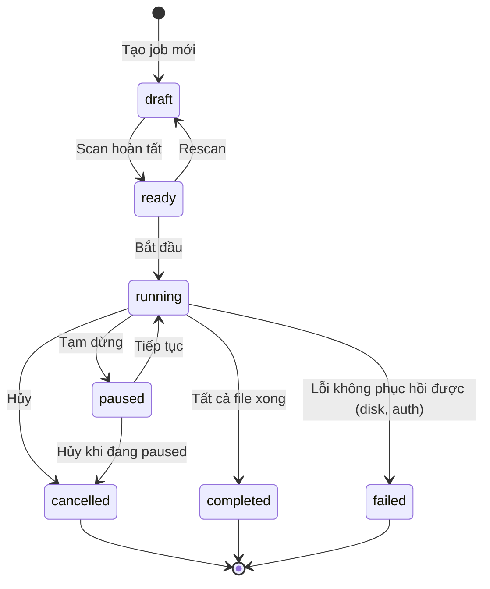
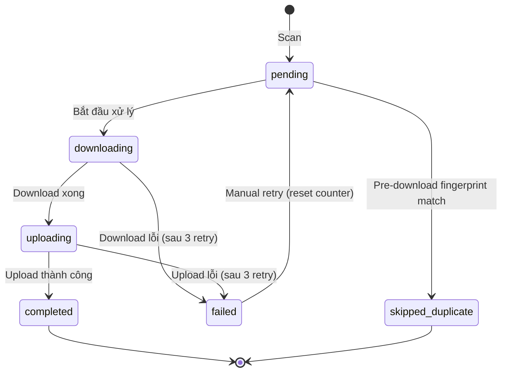
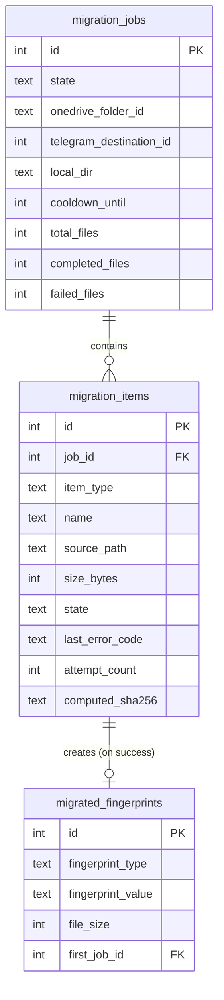

# Data Model: OneDrive Migration (MVP)

**Feature**: 001-onedrive-migration | **Phase**: 1 — Design & Contracts | **Ngày**: 2026-07-23

## Tổng quan

Database `migration.db` (SQLite, WAL mode, synchronous=FULL, tách biệt với `shares.db`) chứa **3 business tables**:
- `migration_jobs` — Job metadata và trạng thái
- `migration_items` — Danh sách file/thư mục trong snapshot
- `migrated_fingerprints` — Lịch sử fingerprint của file đã upload thành công

Microsoft token không được persist — chỉ nằm trong Rust process memory.

---

## Bảng 1: migration_jobs

Lưu thông tin migration job. Mỗi thời điểm chỉ có tối đa 1 job `running`.

```sql
CREATE TABLE IF NOT EXISTS migration_jobs (
    id              INTEGER PRIMARY KEY AUTOINCREMENT,
    -- Job state machine (xem State Transitions bên dưới)
    state           TEXT NOT NULL DEFAULT 'draft'
                    CHECK(state IN ('draft','ready','running','paused',
                         'completed','cancelled','failed')),
    -- Nguồn OneDrive
    onedrive_folder_id    TEXT,     -- OneDrive item ID của thư mục nguồn
    onedrive_folder_path  TEXT,     -- Đường dẫn hiển thị (vd: "/Documents/Backup")
    -- Telegram destination
    telegram_destination_id   INTEGER,  -- folder_id (NULL = Saved Messages)
    telegram_destination_name TEXT,     -- Tên hiển thị
    -- Local working directory
    local_dir           TEXT,     -- Đường dẫn tuyệt đối thư mục local
    -- Cooldown
    cooldown_until      INTEGER,  -- Unix timestamp, NULL nếu không trong cooldown
    -- Stats (denormalized để query nhanh)
    total_folders       INTEGER NOT NULL DEFAULT 0,
    total_files         INTEGER NOT NULL DEFAULT 0,
    total_bytes         INTEGER NOT NULL DEFAULT 0,
    completed_files     INTEGER NOT NULL DEFAULT 0,
    completed_bytes     INTEGER NOT NULL DEFAULT 0,
    failed_files        INTEGER NOT NULL DEFAULT 0,
    skipped_duplicates  INTEGER NOT NULL DEFAULT 0,
    pending_files       INTEGER NOT NULL DEFAULT 0,
    -- Timestamps
    created_at          INTEGER NOT NULL,  -- Unix timestamp
    started_at          INTEGER,           -- Khi chuyển sang running
    completed_at        INTEGER,           -- Khi kết thúc (completed/cancelled/failed)
    updated_at          INTEGER NOT NULL   -- Cập nhật mỗi khi có thay đổi
);
```

### State Transitions



### State Rules
- **draft**: Job mới tạo, chưa scan hoặc đang setup. Cho phép chỉnh sửa cấu hình.
- **ready**: Đã scan, sẵn sàng chạy. Cho phép rescan.
- **running**: Đang xử lý file. Không cho phép thay đổi cấu hình. Chỉ 1 job ở state này.
- **paused**: Tạm dừng sau file hiện tại. Có thể resume hoặc cancel.
- **completed**: Tất cả file đã xử lý (completed, skipped_duplicate, hoặc failed).
- **cancelled**: Người dùng hủy. File đã completed giữ nguyên.
- **failed**: Lỗi không phục hồi được (token hết hạn không refresh được, disk error, etc.).

---

## Bảng 2: migration_items

Lưu danh sách file và thư mục trong migration snapshot.

```sql
CREATE TABLE IF NOT EXISTS migration_items (
    id              INTEGER PRIMARY KEY AUTOINCREMENT,
    job_id          INTEGER NOT NULL,
    -- Thông tin file/thư mục
    item_type       TEXT NOT NULL DEFAULT 'file'
                    CHECK(item_type IN ('file', 'folder')),
    name            TEXT NOT NULL,          -- Tên file/thư mục
    source_path     TEXT NOT NULL,          -- Đường dẫn tương đối từ thư mục nguồn
    source_item_id  TEXT,                   -- OneDrive item ID
    size_bytes      INTEGER NOT NULL DEFAULT 0,
    -- Source snapshot (dùng cho source_changed detection)
    source_etag             TEXT,           -- OneDrive eTag lúc scan
    source_last_modified    TEXT,           -- ISO 8601 lúc scan
    source_fingerprint_type TEXT,           -- Provider fingerprint type (onedrive_quickxor, onedrive_sha1, hoặc NULL)
    source_fingerprint_value TEXT,          -- Provider fingerprint value (base64/hex, hoặc NULL)
    -- Trạng thái xử lý
    state           TEXT NOT NULL DEFAULT 'pending'
                    CHECK(state IN ('pending', 'downloading', 'uploading',
                         'completed', 'skipped_duplicate', 'failed')),
    -- Kết quả
    last_error_code TEXT,                   -- NULL nếu success
                    CHECK(last_error_code IS NULL OR last_error_code IN (
                        'source_changed', 'network', 'auth',
                        'telegram_file_too_large', 'insufficient_disk',
                        'working_directory_unavailable', 'recovery_interrupted',
                        'download_failed', 'upload_failed', 'unknown')),
    last_error_message TEXT,                -- Chi tiết lỗi
    attempt_count   INTEGER NOT NULL DEFAULT 0,
    -- Fingerprint (tính từ nội dung sau download)
    computed_sha256 TEXT,                   -- SHA-256 canonical hash (hex lowercase)
    -- Telegram result
    telegram_message_id INTEGER,            -- NULLABLE — chỉ capture nếu Grammers trả về trực tiếp
    -- Timestamps
    created_at      INTEGER NOT NULL,
    completed_at    INTEGER,               -- Khi hoàn thành (success/fail/skip)
    UNIQUE(job_id, source_path)             -- Mỗi path xuất hiện 1 lần trong job
);

CREATE INDEX idx_items_job_state ON migration_items(job_id, state);
CREATE INDEX idx_items_job_type ON migration_items(job_id, item_type);
```

### Item State Transitions



---

## Bảng 3: migrated_fingerprints

Lịch sử fingerprint của file đã upload thành công. Dùng chung giữa các job. Mỗi fingerprint record có composite unique key `(fingerprint_type, fingerprint_value, file_size)`.

```sql
CREATE TABLE IF NOT EXISTS migrated_fingerprints (
    id                  INTEGER PRIMARY KEY AUTOINCREMENT,
    fingerprint_type    TEXT NOT NULL,          -- 'onedrive_quickxor', 'sha256', 'onedrive_sha1'
    fingerprint_value   TEXT NOT NULL,          -- Giá trị hash (base64 cho quickxor, hex lowercase cho sha256)
    file_size           INTEGER NOT NULL,       -- Kích thước file (bytes)
    first_job_id        INTEGER NOT NULL,       -- Job đầu tiên upload file này
    first_item_id       INTEGER NOT NULL,       -- Item đầu tiên upload file này
    telegram_destination_id INTEGER,            -- Destination đã upload
    telegram_message_id INTEGER,                -- NULLABLE
    completed_at        INTEGER NOT NULL,       -- Unix timestamp
    UNIQUE(fingerprint_type, fingerprint_value, file_size)
);

CREATE INDEX idx_fingerprints_type_value ON migrated_fingerprints(fingerprint_type, fingerprint_value);
```

### Fingerprint Types & Rules

| fingerprint_type | Nguồn | Khi nào có | Dùng cho |
|---|---|---|---|
| `onedrive_quickxor` | `file.hashes.quickXorHash` từ OneDrive Graph API | Metadata trả về hash | Pre-download duplicate skip |
| `sha256` | Tính từ file content trong stream download | Luôn có sau download | Post-download duplicate skip, canonical fingerprint |
| `onedrive_sha1` | `file.hashes.sha1Hash` từ OneDrive Graph API (nếu có) | Metadata trả về hash | Pre-download duplicate skip (dự phòng) |

**Quy tắc so sánh**:
- Chỉ so sánh fingerprint trong cùng `fingerprint_type` — không so sánh QuickXorHash với SHA-256.
- File size phải khớp.
- KHÔNG dùng filename, relative path, modified time làm duplicate identity.

**Composite uniqueness**: `(fingerprint_type, fingerprint_value, file_size)` — cùng hash type + cùng value + cùng size = duplicate.

---

## Entity Relationships



---

## Startup Recovery Mapping

Khi backend khởi động, tất cả item được ánh xạ trạng thái như sau:

| Current persisted state | Recovery state | Ghi chú |
|---|---|---|
| `pending` | `pending` | Giữ nguyên |
| `downloading` | `pending` + `last_error_code = 'recovery_interrupted'` | Cleanup `.part` không hợp lệ |
| `uploading` | `pending` + `last_error_code = 'recovery_interrupted'` | Cleanup `.part` không hợp lệ |
| `completed` | `completed` | Giữ nguyên — không xử lý lại |
| `skipped_duplicate` | `skipped_duplicate` | Giữ nguyên — không xử lý lại |
| `failed` | `failed` | Giữ nguyên |

**Quy tắc**:
- Reset `downloading`/`uploading` về `pending` — KHÔNG tăng `attempt_count` chỉ vì app restart.
- Cleanup file `.part` không hợp lệ.
- KHÔNG auto-start job sau recovery.
- Người dùng reconnect Microsoft nếu cần, rồi nhấn Resume.

---

## Validation Rules

### Job-level
- Chỉ 1 job `running` tại một thời điểm (enforced bởi DB check + in-process `Arc<AtomicBool>` guard)
- `onedrive_folder_id`, `local_dir`, `telegram_destination_id` phải được set trước khi chuyển `ready` → `running`
- `completed_files + failed_files + skipped_duplicates + pending_files = total_files`
- `pending_files = 0` → có thể chuyển sang `completed`

### Item-level
- `source_path` unique trong mỗi job
- `attempt_count ≤ 3` cho auto-retry. Manual retry reset về 0.
- `state = 'completed'` → `computed_sha256` phải được set và fingerprint(s) phải tồn tại trong `migrated_fingerprints`
- `state = 'skipped_duplicate'` → fingerprint phải tồn tại trong `migrated_fingerprints`
- Reset `downloading`/`uploading` về `pending` khi recovery — không tăng `attempt_count`

### Fingerprint-level
- `(fingerprint_type, fingerprint_value, file_size)` composite unique
- Chỉ thêm vào khi item `completed` (upload Telegram thành công + local persist thành công)
- Transaction: item completed + insert fingerprint(s) + update job counters — atomic
- Nếu COMMIT thất bại: item chưa completed, fingerprint chưa được ghi, file tạm được giữ
- **Known limitation**: Crash sau Telegram upload thành công nhưng trước COMMIT → file có thể upload lại sau Resume (at-least-once)

---

## Denormalized Stats

Stats trong `migration_jobs` được cập nhật mỗi khi item thay đổi trạng thái để tránh `COUNT(*)` query thường xuyên:

```sql
-- Cập nhật stats sau mỗi item change
UPDATE migration_jobs SET
    completed_files = (SELECT COUNT(*) FROM migration_items WHERE job_id = ? AND state = 'completed'),
    completed_bytes = (SELECT COALESCE(SUM(size_bytes), 0) FROM migration_items WHERE job_id = ? AND state = 'completed'),
    failed_files = (SELECT COUNT(*) FROM migration_items WHERE job_id = ? AND state = 'failed'),
    skipped_duplicates = (SELECT COUNT(*) FROM migration_items WHERE job_id = ? AND state = 'skipped_duplicate'),
    pending_files = (SELECT COUNT(*) FROM migration_items WHERE job_id = ? AND state = 'pending'),
    updated_at = strftime('%s', 'now')
WHERE id = ?;
```
